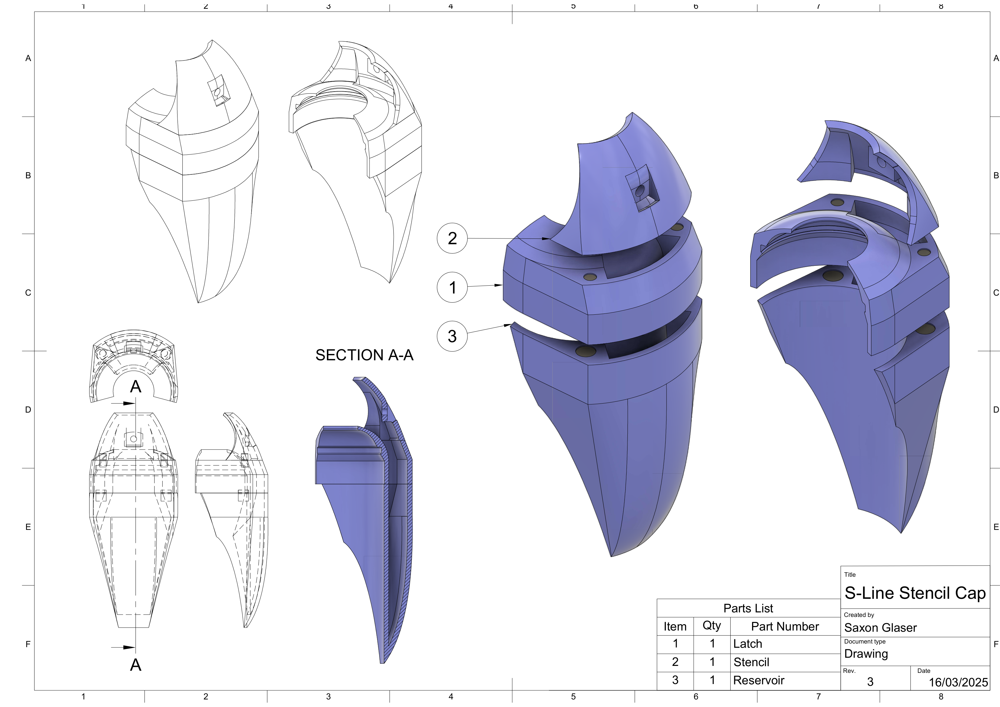

# Metro Stencil Cap

3D-printable stencil cap for spray cans, for laying fine lines in detail work.

> **Note:** The technical drawing above shows the older 3-part design. The current design is 2-part. The drawing cannot be updated — most of the original files were lost when deleting my Fusion360 account..

## Assembly

- Print in PETG (UV stable, resistant to acetone).
- Print orientation as shown below.

- The shield attaches to the base with 4 cylindrical neodymium magnets (5 mm × 5 mm), super glued in place. Check magnet polarities before gluing.
- The shield hole can be drilled to size. A 4 mm drill bit works well.

## Use

1. Snap the stencil base around the can.
2. Snap the shield onto the base magnetically.
3. Higher pressure, smaller nozzles work best (e.g. Montana Grey or Universale caps).

Paint passes through the shield, producing a fine line. Excess paint collects in the reservoir at the front. When the reservoir nears capacity, remove the shield and pour the excess into a waste container.

## Source files

The 3D source files are not included. They were created in Fusion 360 and I have since deleted my account in favor for FreeCAD.

## Gallery

