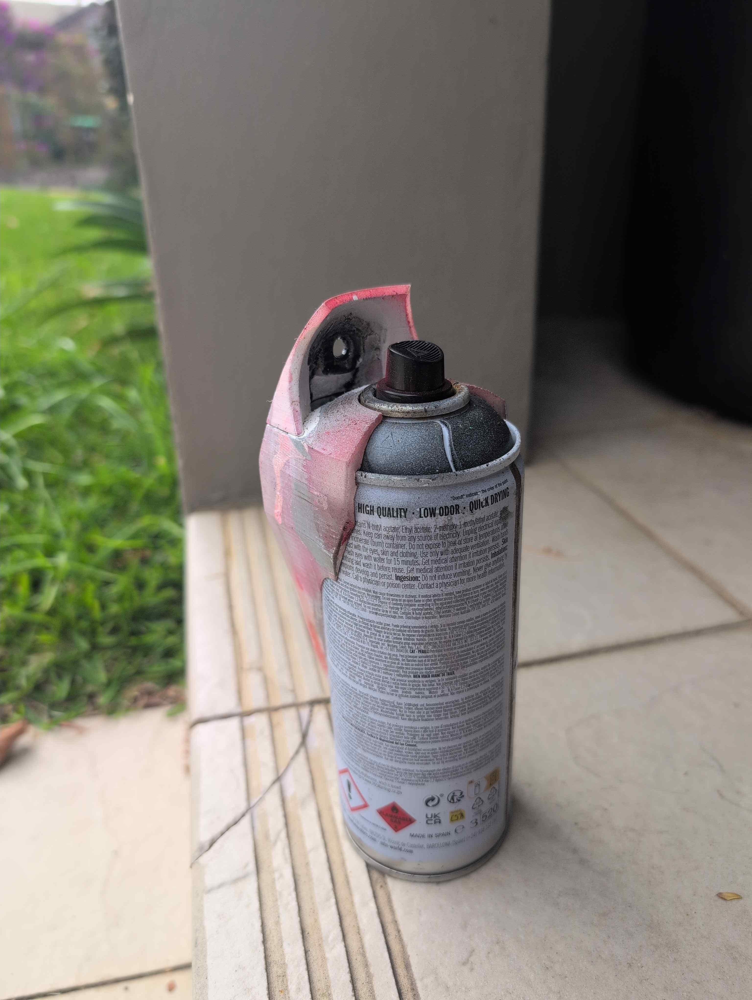
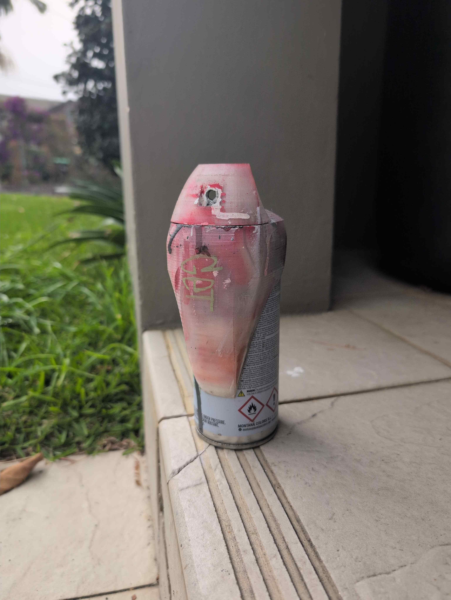
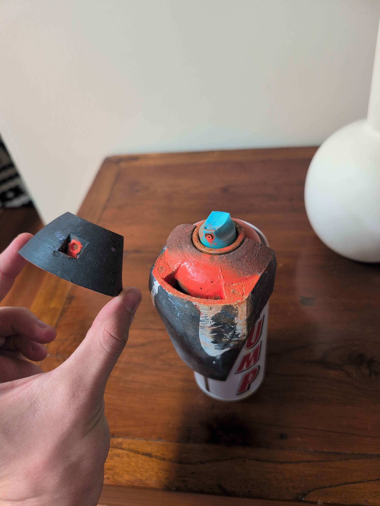
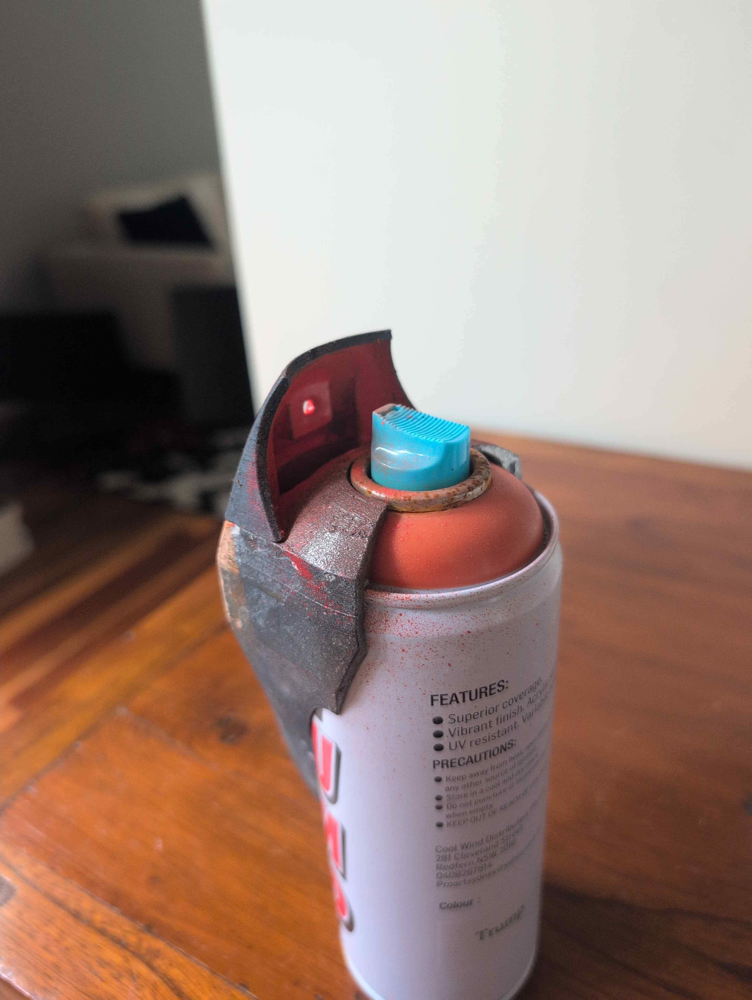
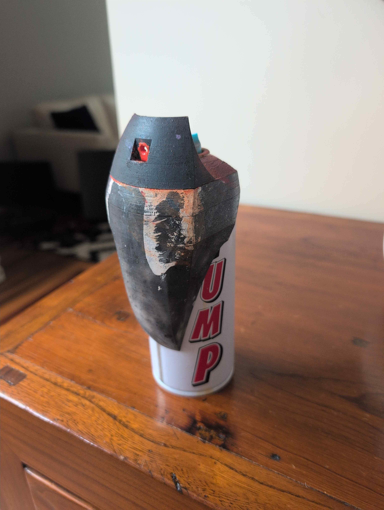

## Metro Stencil Cap

 
Metro stencil cap is a 3D-printable stencil cap to aid in painting detail work with a spray can. 

**Note:** The technical drawing above uses an old 3 part design, rather than the updated 2 part design. I am unable to edit this after losing access to many of the files when switching from Fusion 360 to FreeCAD.

## 🔧 Making

I print in PETG as it can withstand the Aussie sun, and is chemical resistant to cleaning with acetone.

The suggested print orientation is shown in the images below:

The shield attaches to the base via 4 cylindrical neodymium magnets (5mm x 5mm). These are best super glued into the assembly. PLAN POLARITIES!

The shield hole can be drilled to size. I find that a 4mm drillbit works best.

## 🫟 Use

Stencil base snaps around the can & shield snaps onto the base magnetically. I find higher pressure smaller nozzles work best — i.e. Montana Grey or Universale caps.

Paint filters through the shield to give a precise line. Excess paint fills the reservoir at the front. Simply remove the shield and tip the can into a waste container when it nears filling up.

 
## 🧠 Considerations
I am unable to provide the actual 3d files, as they were made in Fusion 360 before I moved all my creations to FOSS software. I have since lost all my Fusion files.

## 🖼️ Gallery

 

