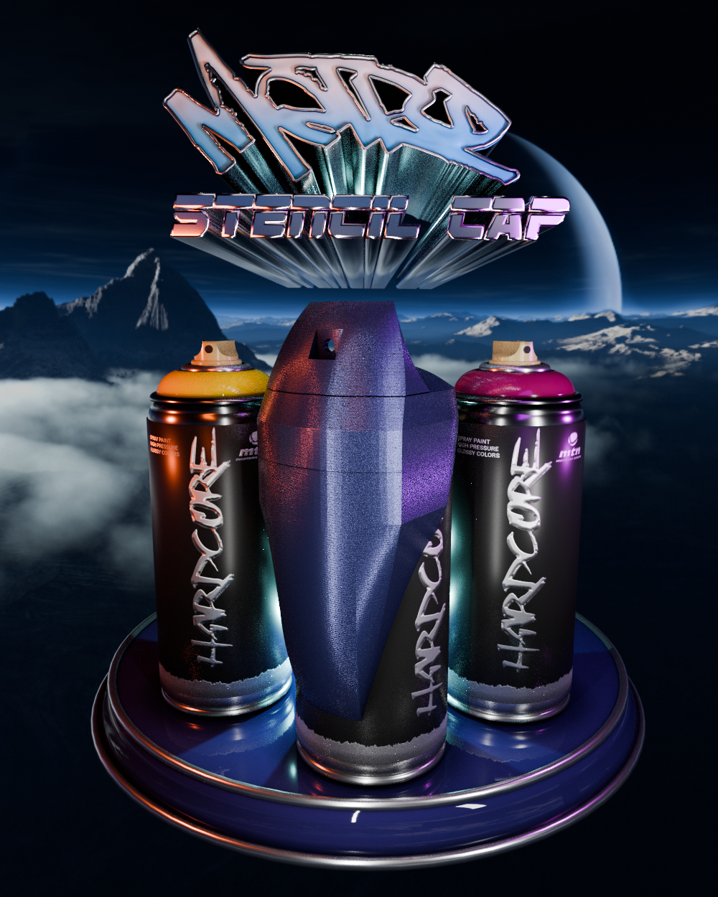
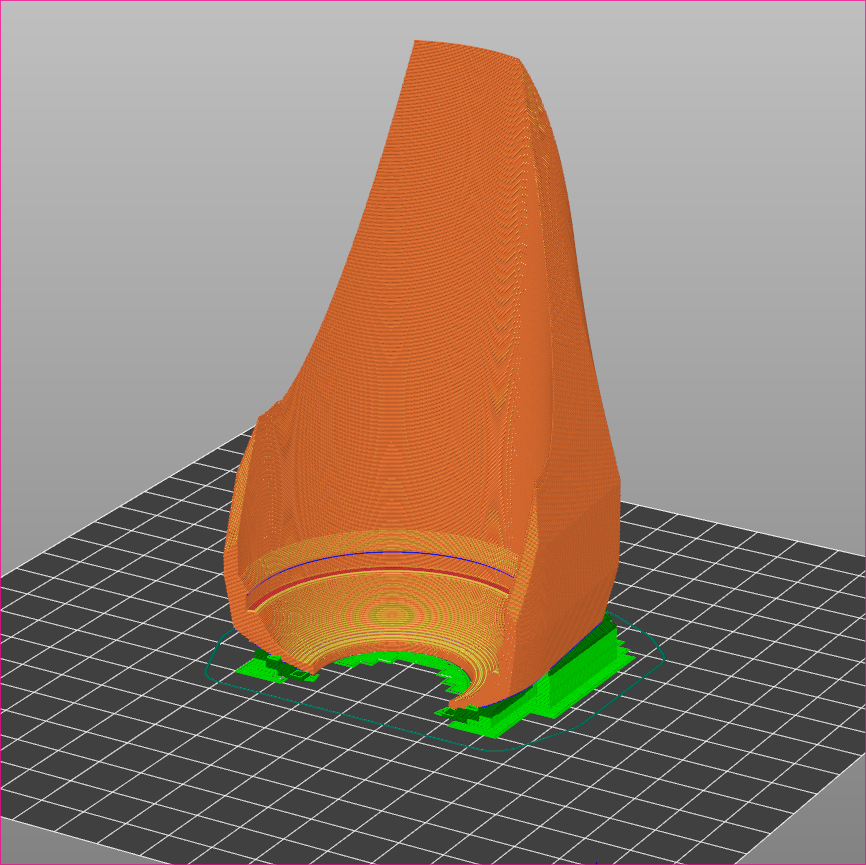
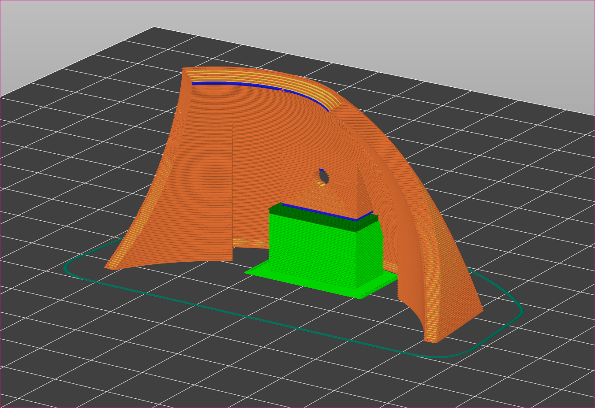

## Metro Stencil Cap

 
Metro stencil cap is a 3D-printable stencil cap to aid in painting detail work with a spray can. 

svg logo header.
short text intro
advertiseement.

## Making

I print in PETG as it can withstand the Aussie sun, and also chemical resistant to cleaning with acetone.

The suggested print orientation is shown in the images below:

The shield attaches to the base via 4 cylinderical neodym magnets (5mmx5mm). These are best super glued into the assembly. PLAN POLARITIES!

The shield hole can be drilled to size. I find that 4mm drillbit works best.

## Use 

Stencil base snaps around the can. Sheild snaps onto base magnetically. I find higher pressure smaller nozzels work best. Ie montanna grey or universale caps.

Paint filters through shield to give a precise line. Excess paint fills the resovior at front. Simply remove the shield and tip the can into a waste continer when it nears filling up.

 
## Considerations
I am unable to provide the actual 3d files, as they were made in Fusion360 before I moved all my creations to FOSS software. I have sinse lost all my fusion Files.

 

